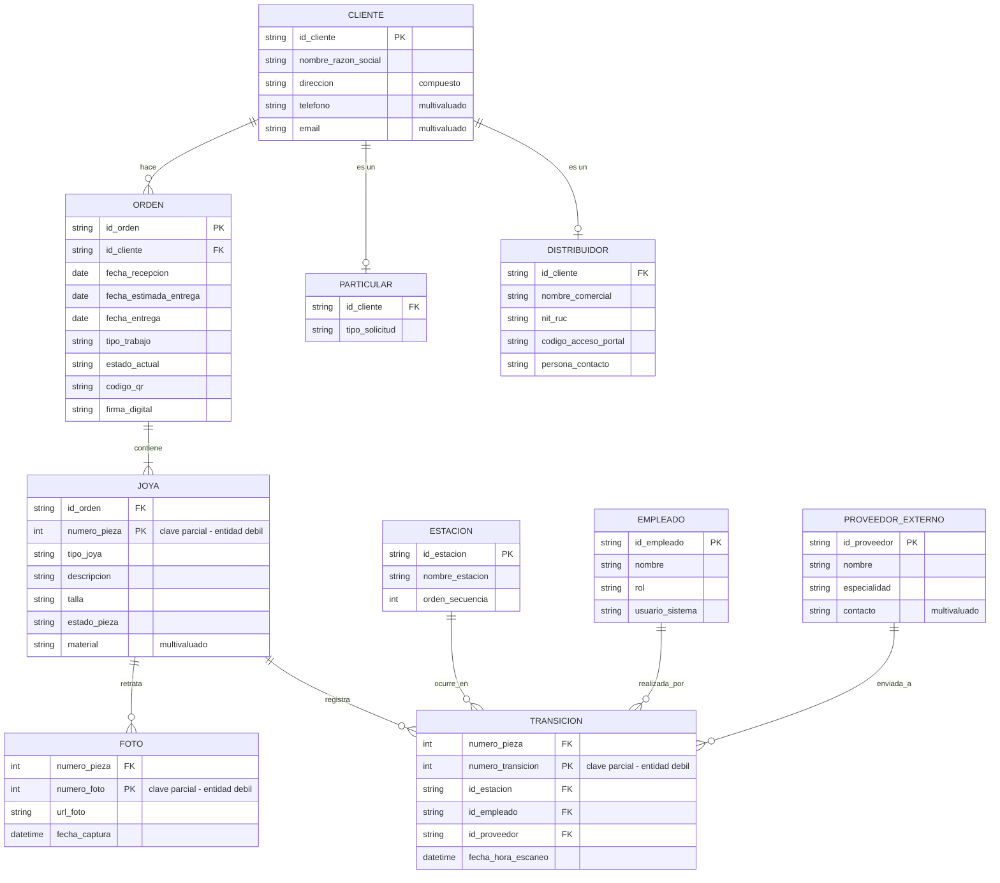

# Modelo Entidad-Relación

Diagrama original en notación de Chen: [`CrisjonDiagramaEntidadRelacion.drawio.svg`](diagramas/CrisjonDiagramaEntidadRelacion.drawio.svg)

## Diagrama (notación pata de gallo)

## Notas del modelo

**Entidades débiles.** `Joya`, `Foto` y `Transicion` son débiles: su clave primaria es parcial y
depende de la entidad fuerte a la que se identifican (`Orden`, `Joya` y `Joya` respectivamente).
Mermaid no tiene notación para entidad débil; en el diagrama de arriba se representan con relación
identificadora y la clave parcial marcada en el comentario.

**Especialización.** `Cliente` se especializa en `Particular` y `Distribuidor` (disjunta).
Mermaid no soporta la notación de triángulo, así que aparecen como entidades relacionadas 1:0..1.

**Atributos multivaluados.** `telefono`, `email`, `material` y `contacto` son multivaluados. Al pasar
a modelo relacional, cada uno se convierte en una tabla aparte con clave foránea a su entidad.

**Atributo compuesto.** `direccion` de `Cliente` se descompone en `tipo_via_principal`,
`numero_via_principal`, `numero_via_secundaria`, `complemento` y `referencia_domicilio`.

**Cardinalidades.** Todas las relaciones del modelo son 1:N en el sentido indicado por la flecha
(un cliente hace muchas órdenes, una orden contiene muchas joyas, una joya tiene muchas fotos y
muchas transiciones, y cada transición ocurre en una estación, la realiza un empleado y puede
enviarse a un proveedor externo).
